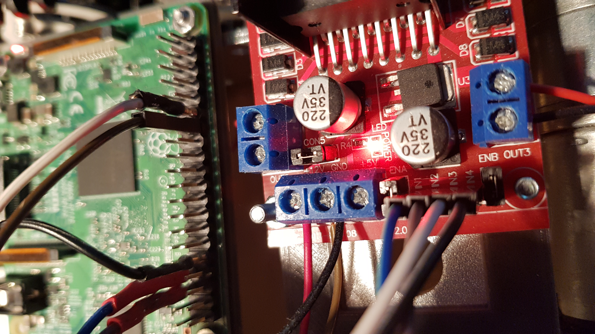
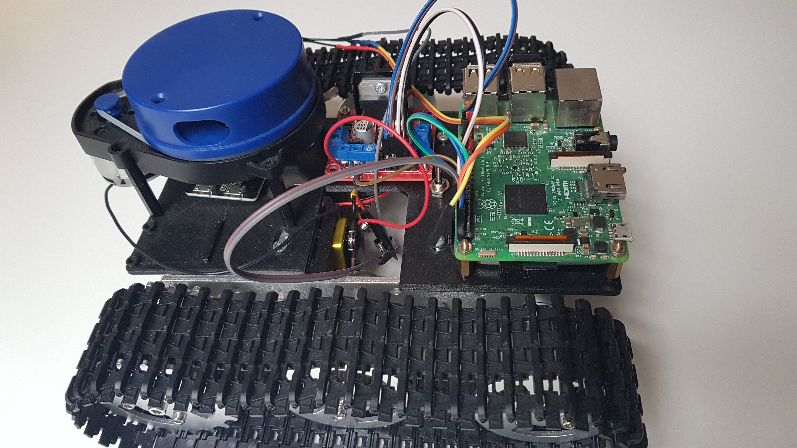
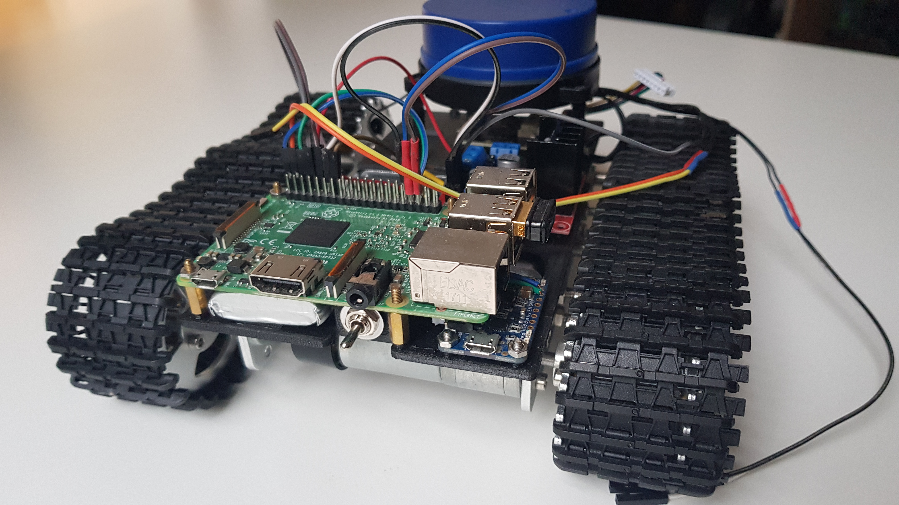
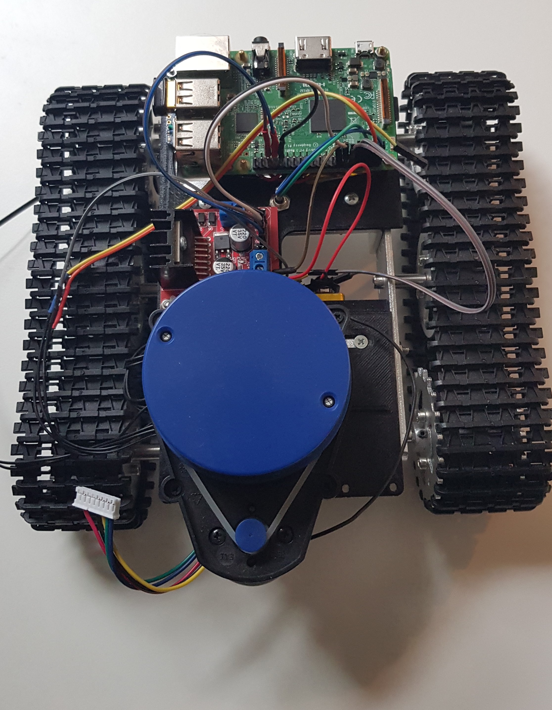
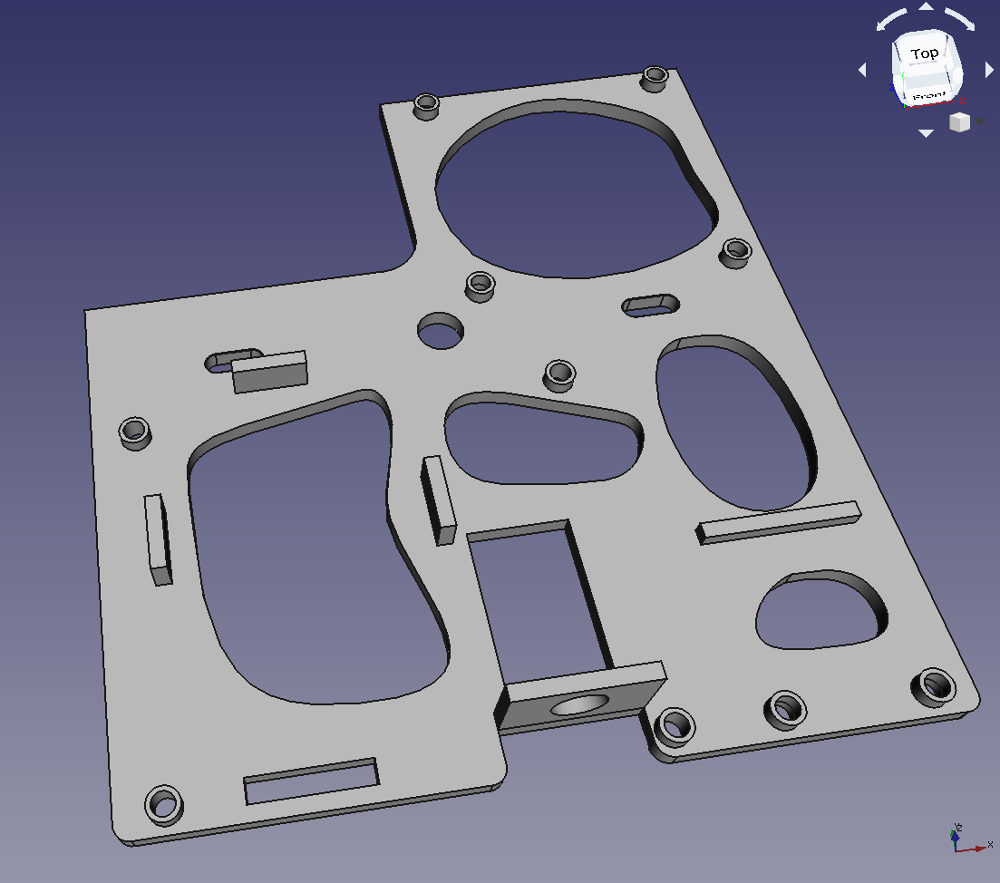
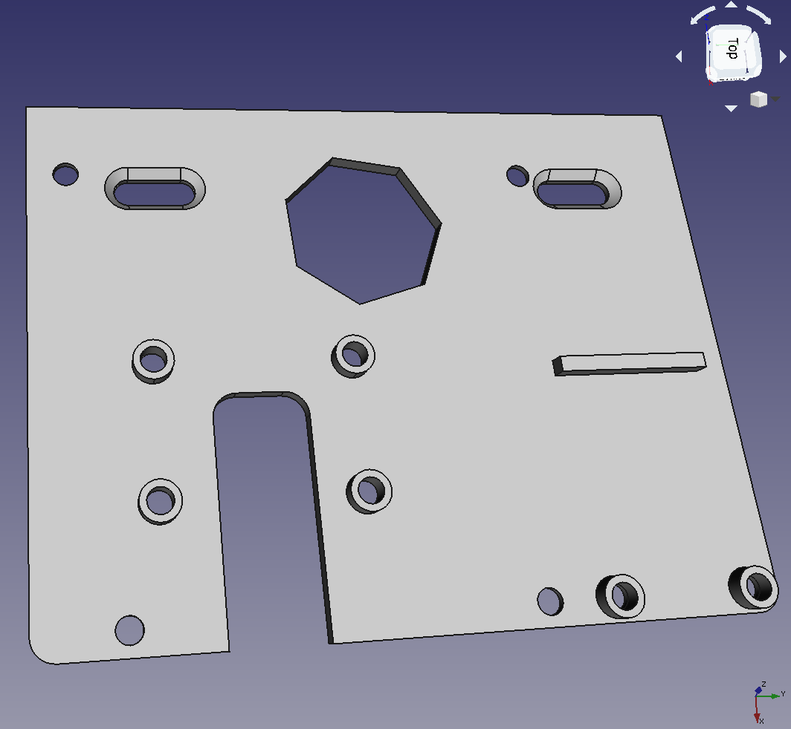
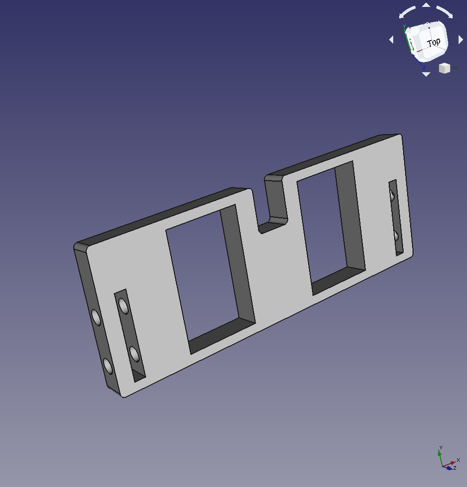

# ROS AGV  

Lidar guided autonomous robot  

## Start  
Catkin workspace root folder: `src/`  
```
 $ catkin_make  
 $ source /devel/setup.bash  
 $ roslaunch raspi_ctrl raspi.launch  
```

### Remote RVIZ client  
```
export ROS_MASTER_URI=http://<ROBOT IP>:11311/
export ROS_IP=<REMOTE RVIZ CLIENT IP> 
```
see `/rviz/setup_ros_env.sh`  
```
$ roslaunch raspi_ctrl rviz.launch
```  

Manual keyboard control via [Teleop twist keyboard](http://wiki.ros.org/teleop_twist_keyboard)  

## Hardware  

* Raspberry Pi 3  
* L298N dual H-Bridge  
* Ydlidar X4  
* LiPo 3.7V JST PH 2.0

## Setup  

* Ubuntu 18.04 LTS
* ROS Melodic  
* `$ sudo ./ros_install.sh`  

### Motor wiring  
H-Bridge | Raspberry Pi GPIO
--- | ---: 
N1 | 13 (PWM1)
N2 | 19 (PWM1)
N3 | 18 (PWM0)
N4 | 12 (PWM0)




[//]: <> (https://funduino.de/nr-34-motoren-mit-h-bruecke-l298n-ansteuern)

## ROS TF  

  


# Project structure  
```
├── README.md
├── build (gen)
├── devel (gen)
├── cad
├── doc
│   ├── cad_designs/... 
│   ├── photos/... 
│   ├── frames.pdf
│   ├── raspberry_pi_3_PWM_pins.png
│   ├── rqt_graph.svg
│   └── wiring_hbrige_raspi.jpg
├── ros_install.sh
└── src
    ├── CMakeLists.txt -> /opt/ros/melodic/share/catkin/cmake/toplevel.cmake
    ├── motor_pkg
    │   ├── CMakeLists.txt
    │   ├── bin
    │   │   └── motor_ctrl
    │   ├── package.xml
    │   ├── setup.py
    │   └── src
    │       └── motor_ctrl
    │           ├── __init__.py
    │           ├── motor.py
    │           └── name_ascii.txt
    ├── raspi_ctrl
    │   ├── CMakeLists.txt
    │   ├── launch
    │   │   ├── costmap_configs
    │   │   │   ├── base_local_planner_params.yaml
    │   │   │   ├── costmap_common_params.yaml
    │   │   │   ├── global_costmap_params.yaml
    │   │   │   └── local_costmap_params.yaml
    │   │   ├── mapping_default.launch
    │   │   ├── raspi.launch
    │   │   ├── rviz.launch
    │   │   └── x4_lidar.launch
    │   ├── package.xml
    │   └── rviz
    │       ├── rviz.rviz
    │       └── setup_ros_env.sh
    ├── teleop_twist_keyboard
    └── ydlidar_ros
```

## Robot assembly  




## FreeCAD designs  

Top power & control | Lidar   
--|-- 
 |   
Bottom power  |
 | 